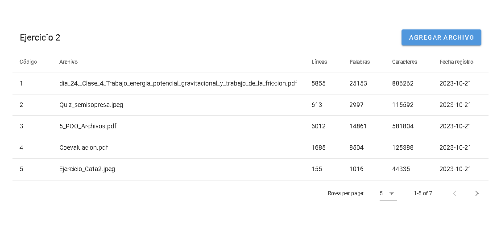

# Ejercicio 2

## Requerimientos
- Versión de Python > 10.8.
- Versión de pip > 21.
- Versión de node > 16.

Se sugiere crear un entorno virtual de python dentro de la carpeta _backend/_ e instalar los paquetes que se encuentran en el archivo de *requirements.txt*. Para esto realizar lo siguiente:

```console
cd /ejercicio-2/backend
python -m venv pyenv

# Activar el entorno virtual.
# Para Windows dirigirse a pyenv/Scripts/ y ejecutar activate.
# Para Linux y MAC dirigirse a pyenv/bin/ y ejecutar activate.
# Consultar activar el entorno en: https://docs.python.org/3/library/venv.html

pip install -r requirements.txt
```
## Variables de entorno
Crear un archivo de variables de entorno dentro de la carpeta _backend/_ de nombre _.env._ Agregar la variable:

```python
SQLALCHEMY_DATABASE_URI='mysql+mysqldb://root:example@<host>:<port>/datosdb'
```

## Despliegue de contenedor docker con MySQL y adminer

Se puede desplegar un contenedor de docker con MySQL y adminer (sacado por defecto de la web https://hub.docker.com/_/mysql). Para esto ejecutar el comando dentro de la carpeta **ejercicio-2:**

```console
docker compose up -d
```

El servicio de **Adminer** se comunica con MySQL y se puede acceder por el puerto 8080.

## Creación de base de datos _datosdb_ y tabla _información_

Se debe crear la base de datos **datosdb** en MySQL. El script de creación de la base de datos y de la tabla se encuentran en el archivo **db_script.sql.**

#### Nota.
La tabla puede ser generada ejecutando los comandos:

```console
flask --app programa1 db migrate -m "Initial migration..."
flask --app programa1 db upgrade
```
## Para ejecutar el backend
Una vez se ha realizado todo lo anterior se puede proceder a ejecutar el backend:
```console
python programa1.py
```

## Para ejecutar el frontend
- Se debe tener instalado node en las últimas versiones (realizado con 16.17.0).

Ejecutar los comandos:
```console
npm i
npm run dev
```

Se desplegará el frontend en **localhost:3000** y se comunica con el backend
**sí o sí** en localhost:5000. En caso de cambiar el puerto, se deberá cambiar
el código del frontend dentro de los métodos.

## Evidencia de funcionamiento

