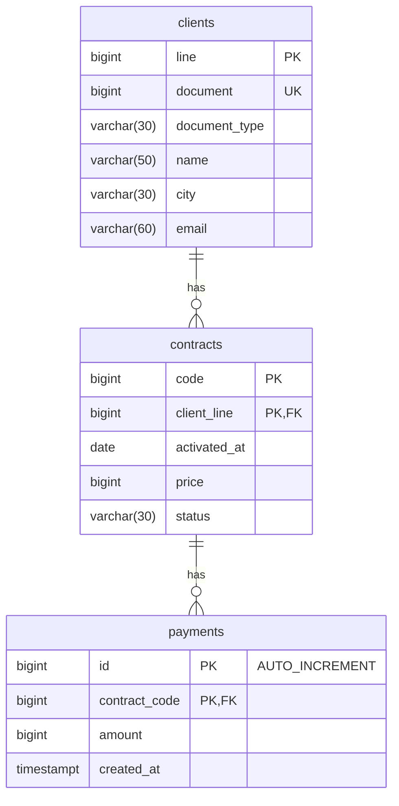

# Proyecto 1

## Descripción

El proyecto fue realizado separando el frontend y backend. Para el frontend se utilizaron las tecnologías exigidas (HTML, CSS, Javascript, Bootstrap) y para el backend PHP.

El backend de PHP fue ejecutado inicialmente en Xampp y después se traslado el contenido a la carpeta de backend.

La base de datos fue desplegada en un contenedor de docker con la imagen de __postgres:15.2-alpine.__ Además, se utilizó **pgAdmin** para administrar dicha base de datos.

Para iniciar el contenedor de postgres ejecutar:
```console
docker run -d --name postgres -p 5432:5432 -e POSTGRES_PASSWORD=example -e POSTGRES_HOST_AUTH_METHOD=trust -e PGPORT=5432 postgres:15.2-alpine
```

Para iniciar el contenedor de pgadmin ejecutar:
```console
docker run -d --name pgadmin -p 5050:5050 -e PGADMIN_DEFAULT_EMAIL=root@gmail.com -e PGADMIN_DEFAULT_PASSWORD=root -e PGADMIN_LISTEN_PORT=5050 dpage/pgadmin4
```

O en la carpeta de proyecto-1:
```console
docker compose up -d
```

Para conectar pgAdmin con postgres desde Windows, el **host** corresponde a la dirección IP local del equipo **(192.168.0.x).** En Linux, debería bastar con el __localhost.__

## Variable de entorno

En la carpeta del backend se utilizaron variables de entorno para la conexión con la base de datos. Para ello, crear un archivo **.htaccess** y agregar:

```console
SetEnv POSTGRES_URI 'host=<host> port=<puerto> dbname=clientsdb user=postgres password=example'
```

Generalmente el host es **localhost** y el puerto **5432.**

## Modelado relacional



## Componentes utilizados en el frontend

Se utilizaron algunos componentes de ejemplos del bootstrap para agilizar el diseño:
- https://getbootstrap.com/docs/5.3/examples/grid/
- https://getbootstrap.com/docs/5.3/examples/heroes/
- https://getbootstrap.com/docs/5.3/examples/headers/
- https://getbootstrap.com/docs/5.3/examples/dashboard/
- https://getbootstrap.com/docs/5.3/examples/modals/
- https://getbootstrap.com/docs/5.3/examples/checkout/

## Para ejecutar el backend
Trasladar los archivos del backend al Xampp o servidor correspondiente e iniciar dicho servidor.

## Para ejecutar el frontend
Para el frontend basta con abrir alguno de los archivos HTML. El incial, corresponde a **index.html.**