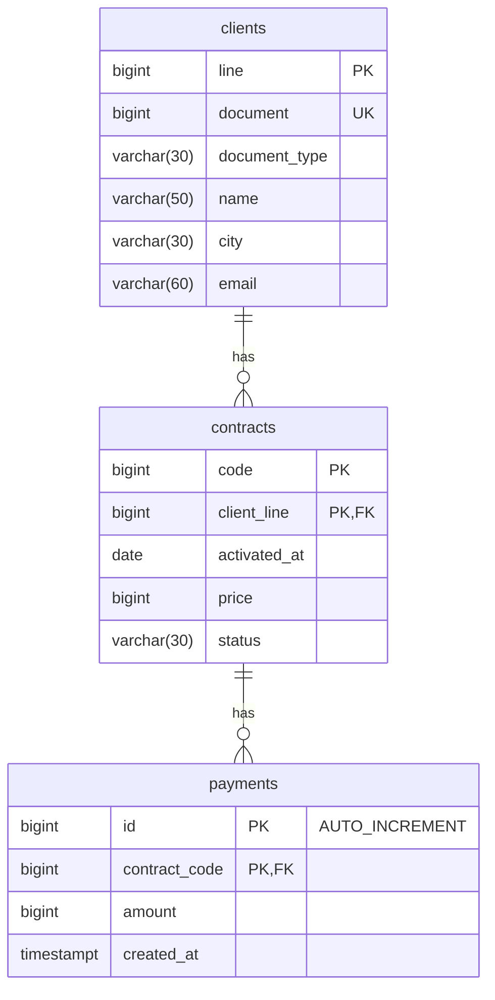

# Proyecto 1

## Modelado relacional

## Componentes utilizados en el frontend

Se utilizaron algunos componentes de ejemplos del bootstrap para agilizar el diseño:
- https://getbootstrap.com/docs/5.3/examples/grid/
- https://getbootstrap.com/docs/5.3/examples/heroes/
- https://getbootstrap.com/docs/5.3/examples/headers/
- https://getbootstrap.com/docs/5.3/examples/dashboard/
- https://getbootstrap.com/docs/5.3/examples/modals/
- https://getbootstrap.com/docs/5.3/examples/checkout/